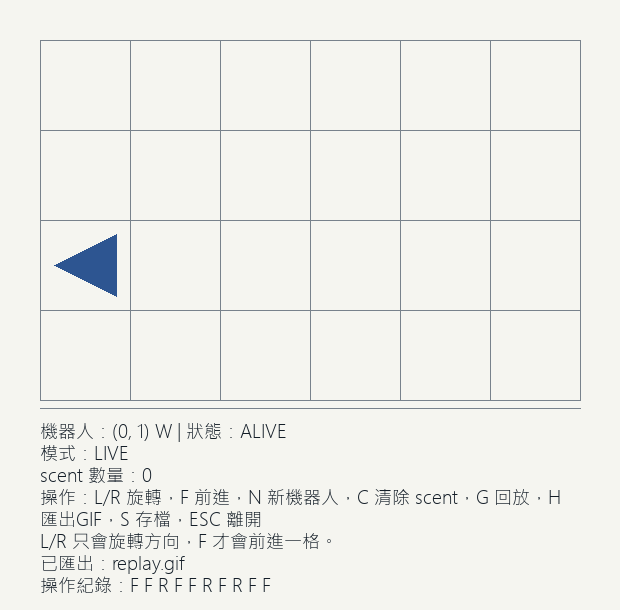

# Week 03 - Robot Lost（1114405021）

## 功能清單

- 以 `robot_core.py` 實作核心規則（L/R/F、越界、LOST、scent）
- 以 `robot_game.py` 提供 pygame 互動畫面
- 可在畫面中觀察：地圖、機器人位置與朝向、狀態（ALIVE/LOST）、scent
- 提供鍵盤操作：`L`、`R`、`F`、`N`、`C`、`ESC`

## 執行方式

1. Python 版本：建議 `3.11+`
2. 安裝 pygame：

```bash
pip install pygame
```

3. 啟動遊戲：

```bash
python robot_game.py
```

## 測試方式

在本目錄執行：

```bash
python -m unittest discover -s tests -p "test_*.py" -v
```

## 資料結構選擇理由

1. `RobotState` 用 dataclass：狀態欄位清楚、可讀性高、便於測試。
2. `set[tuple[int, int, str]]` 儲存 scent：查詢 O(1) 且天然去重，符合規則需求。
3. `MOVE_TABLE` 使用字典：方向對位移映射明確，擴充與維護容易。

## 你踩到的一個 bug 與修正

- 問題：最初把 scent 只記錄 `(x, y)`，導致同位置不同方向也被錯誤忽略。
- 修正：改成 `(x, y, dir)`，讓規則與 UVA 118 一致。

## 遊玩截圖

請放入實際截圖後取消註解：



## 重播方式

- 本版本提供內建回放機制：按 `G` 會把目前操作紀錄逐步重播。
- 回放時 HUD 會顯示 `Mode: REPLAY`，結束後自動回到 `Mode: LIVE`。
- `assets/replay.gif` 仍可作為加值交付項（可自行另外匯出）。
